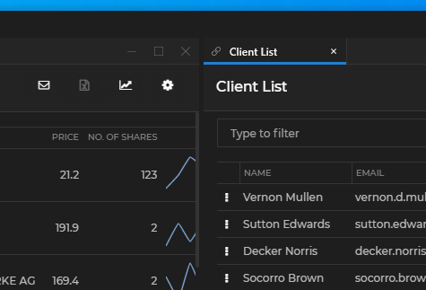
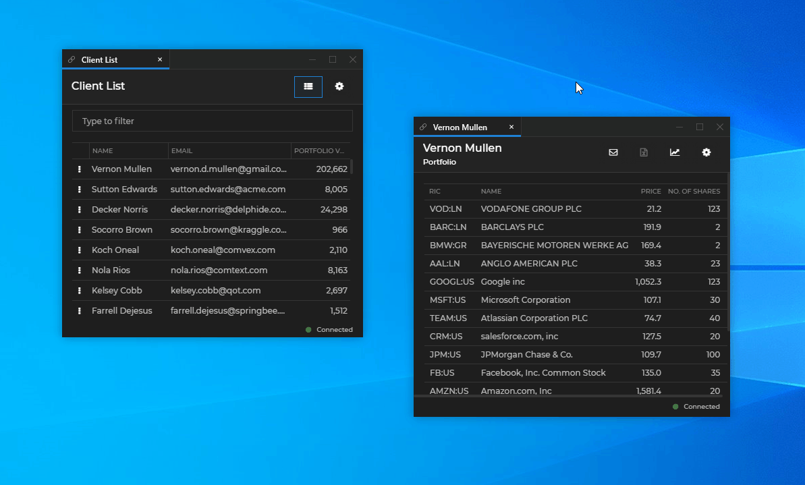
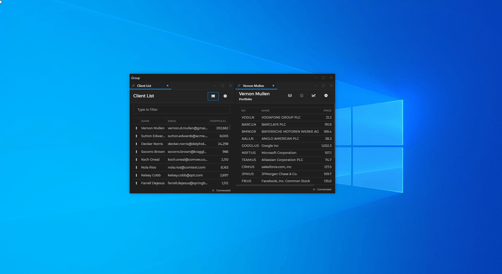
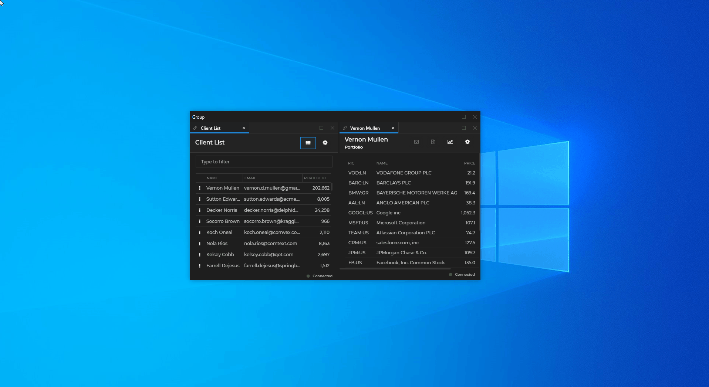
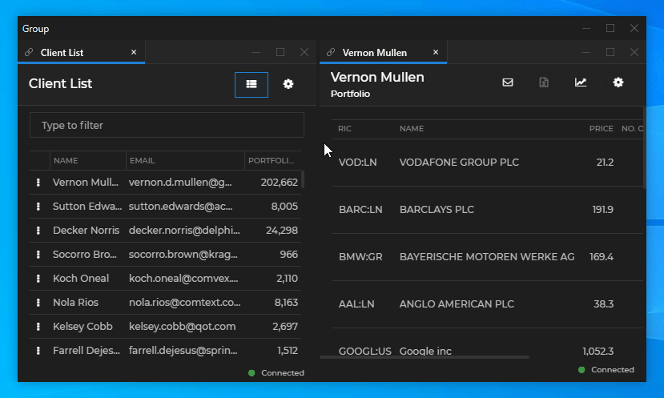
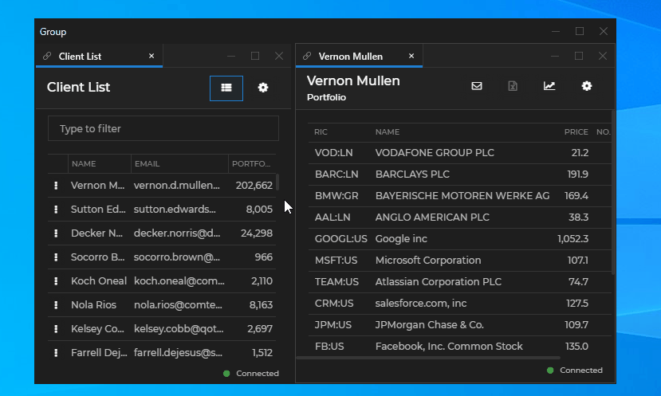
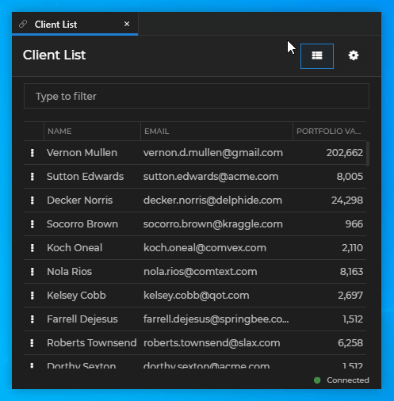

## Glue42 Windows Configuration

The global behavior of [Glue42 Windows](../../../glue42-concepts/windows/window-management/overview/index.html) in [**Glue42 Enterprise**](https://glue42.com/enterprise/) is configured via the `stickywindows.json` configuration file located in the `%LocalAppData%\Tick42\GlueDesktop\config` folder. Some of the configurable properties are explained below. For more details, see the [Glue42 Windows configuration schema](../../../assets/configuration/stickywindows.json).

*Note that some properties in the `stickywindows.json` may be overridden by properties defined in the [app configuration](../application/index.html) file of your app.*

## Glue42 Window Properties

### Classic & Web Groups

Switch from the default Glue42 [classic groups](../../../glue42-concepts/windows/window-management/overview/index.html#window_groups-classic_groups) to the Glue42 [web groups](../../../glue42-concepts/windows/window-management/overview/index.html#window_groups-web_groups):

```json
// The default value is `"Classic"`.
{
    "groupType": "Web"
}
```

### Renderer Transparency Mode

To specify how to handle the transparency of the HTML elements that determine the bounds of app windows in [Glue42 Window groups](../../../glue42-concepts/windows/window-management/overview/index.html#window_groups) and [Workspaces](../../../glue42-concepts/windows/workspaces/overview/index.html), use the `"rendererTransparencyMode"` property. These HTML elements are placed over the app windows and must be transparent in order for the app windows to be visible and for the mouse clicks to reach the app windows. For Windows 7 the mode is fixed to `"Regions"`. For Windows 8+, you can use `"KeyColor"` or `"Transparent"`. The `"KeyColor"` value selects a color that will be used as a background for the overlaying HTML elements and will always be transparent. To specify which color will always be transparent, use the `"rendererTransparencyKeyColor"` property. The `"Transparent"` value enables true transparency in Glue42 [web groups](../../../glue42-concepts/windows/window-management/overview/index.html#window_groups-web_groups) and [Workspaces](../../../glue42-concepts/windows/workspaces/overview/index.html), but won't work if you are using Glue42 [classic groups](../../../glue42-concepts/windows/window-management/overview/index.html#window_groups-classic_groups). In this case, if you set `"Transparent"` as a value, it will be used only for Workspaces, and the classic groups will fall back to `"KeyColor"` or `"Regions"`. Setting `"rendererTransparencyMode"` to `"Auto"` will select `"KeyColor"` (for Windows 8+) or `"Regions"` (for Windows 7) depending on your OS:

```json
{
    "rendererTransparencyMode": "KeyColor",
    "rendererTransparencyKeyColor": "#FE0000"
}
```

*Note that it is strongly recommended for any popup windows in your custom Workspaces App or Web Group App to use shadows or transparency only if `"rendererTransparencyMode"` is set to `"Transparent"`. Otherwise, the shadow or the transparency will blend with the color specified in the `"rendererTransparencyKeyColor"` property which will result in an undesirable visual effect. Also, the color specified in `"rendererTransparencyKeyColor"` shouldn't be used individually or in a gradient, because it will always be rendered as transparent.*

### Edge Distance

Configure the distance between the edges of neighboring Glue42 Windows:

```json
// Constrained to values between `1-9`.
{
    "edgeDistance": 9
}
```



### Group Caption

Hide or show the group caption:

```json
{
    "hideGroupCaption": true
}
```



### Resizing with Windows Gestures

Configure the resize behavior of Glue42 Windows in a group when resizing the group with Windows gestures. Some Glue42 Windows may have size restrictions in their configuration - e.g., `"maxWidth": 200`. Specify whether the rest of the windows in the group should stay relative in size to the restricted windows or should fill the rest of the space. In the examples below, the "Client List" app has a width restriction of 400 pixels:

```json
{
    "groupMaximizedMode": "Proportional"
}
```



```json
{
    "groupMaximizedMode": "Fill"
}
```



### Resizing Windows in a Group

Configure the resize behavior when resizing Glue42 Windows within a group by dragging an inner border:

```json
{
    "sizingMode": "Proportional"
}
```



```json
{
    "sizingMode": "Single"
}
```

*Note that when using `"sizingMode": "Single"`, the `borderSize`, `frameThickness` and `singleFrameThickness` theme properties must not be set to `0`, otherwise you won't be able to resize or stick the Glue42 Windows properly.*



### Flydown Windows

*All values for the flydown delay times and intervals are in milliseconds.*

To set the delay time for showing the flydown window after the user hovers over the flydown zone:

```json
{
    "flydownShowDelay": 250
}
```

To set the delay time for allowing the callback for handling the flydown window to return a result when changing the flydown zone:

```json
{
    "flydownChangeDelay": 200
}
```

To set the delay time for hiding the flydown window (e.g., when the user moves the cursor out of the flydown zone):

```json
{
    "flydownHideDelay": 600
}
```

To set the interval at which the system will check whether the flydown window should be hidden:

```json
{
    "flydownHideCheckInterval": 150
}
```

*Note that the value of `flydownHideCheckInterval` should be less than the value of `flydownHideDelay`, otherwise the flydown window will be hidden at the end of the interval specified in `flydownHideCheckInterval` and not at the end of the delay time specified in `flydownHideDelay`.*

### Tab Header Buttons

Keep buttons on tab windows always visible or show them only on hover:

```json
{
    "tabs": {
        "buttonsAlwaysVisible": false
    }
}
```



### Flat When Single

Show tab windows as flat windows (without a tab header) when they are single:

```json
{
    "tabs": {
        "flatWhenSingle": true
    }
}
```

