## Overview

The Glue42 **Dev Tools** are meant to help both developers and non-technical users to better understand the processes taking place inside the Glue42 enabled applications. They deliver useful internal framework information in an intuitive and user-friendly UI. 

This information is useful when testing app integration, app performance or app interaction with other apps or [contexts](../../glue42-concepts/data-sharing-between-apps/shared-contexts/overview/index.html) within the Glue42 environment. Testing your app behavior doesn't require the use of dummy apps for the debugging process - you can directly see and interfere with the processes taking place between real apps, in real time. Whether you are a single developer working on the compatibility of an app with Glue42, or you collaborate with other dev teams and want to ensure cross-team method implementation consistency, the Dev Tools provide powerful means to extract and monitor the necessary information. 

Launch each Dev Tool from the Dev Tools Launcher application accessible from the Glue42 toolbar.

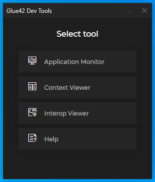

Available applications:

- [Application Monitor](#application_monitor)
- [Performance Report](#performance_report) (accessible from Application Monitor)
- [Context Viewer](#context_viewer)
- [Interop Viewer](#interop_viewer)

In addition, the following tools are also available for debugging:

- [Applications View](../../getting-started/general-overview/index.html#using_glue42_enterprise-applications_view) - a tool that provides general overview of all running hidden or visible applications.
- Press `F12` on a focused Glue42 window to open the built-in browser developer console.
- Add DevTools Extensions supported by Electron to [**Glue42 Enterprise**](https://glue42.com/enterprise/). See [Adding DevTools Extensions](../../glue42-concepts/glue42-platform-features/index.html#adding_devtools_extensions).

## Application Monitor

The Application Monitor provides an overview of all applications running in [**Glue42 Enterprise**](https://glue42.com/enterprise/) and their performance. This tool is useful when you want to gain a general perspective of how an app (or several apps) behaves within [**Glue42 Enterprise**](https://glue42.com/enterprise/). See how much time it takes for [**Glue42 Enterprise**](https://glue42.com/enterprise/) to load your app, how long has the app been running, what potential issues your app has or may cause and compare the performance of different apps.

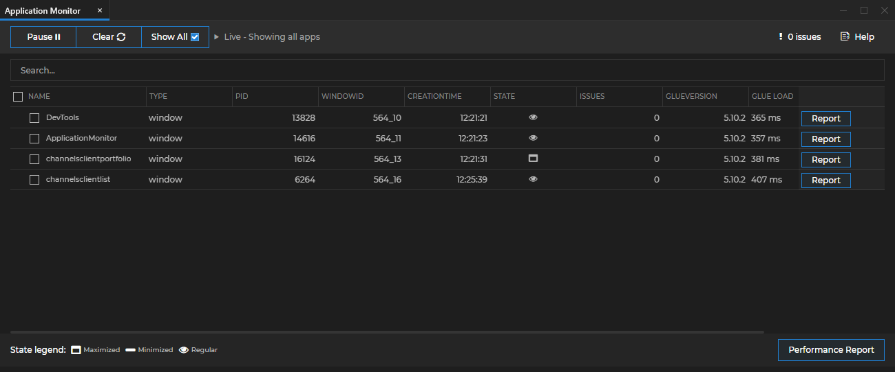

### Enabling Performance Tracking

The Application Monitor is disabled by default. To be able to use the Application Monitor and the Performance Report, enable the tracking of application performance information from the [**Glue42 Enterprise**](https://glue42.com/enterprise/) system configuration. 

Configure the `"performanceTracker"` top-level key in the `system.json` file of [**Glue42 Enterprise**](https://glue42.com/enterprise/) to enable performance tracking:

```json
"performanceTracker": {
    "enable": true,
    "trackAutoStarted": false,
    "isTrackingEnabled": true
}
```

- `"enable"` - whether to enable or disable tracking applications in the [Application Monitor](#application_monitor);
- `"trackAutoStarted"` - whether to track the performance of auto started Glue42 apps;
- `"isTrackingEnabled"` - whether to enable or disable gathering and sending application performance information to [Performance Report](#performance_report);

### Toolbar

The Application Monitor toolbar offers the following grid display controls:

| Button | Description |
|--------|-------------|
|`Clear`| Removes all currently displayed apps from the grid. Use when you want to monitor only newly launched apps.|
|`Show All`| Shows all cleared apps again.|
|`Pause`| Freezes the Application Monitor to its current state and ignores all new updates.|
|`Issues`| Opens a window with issue messages. |
|`Help`| Opens a browser window with the Dev Tools documentation. |

*The "Show All" and "Clear" buttons don't work when you use "Pause".*


Right click anywhere on the grid and select "Export to Excel" from the context menu to export the statistics to Excel:


### Rows

Each row represents an application and the information inside it is updated every 2 seconds. 

- "Report" button - opens a new window with a [Performance Report](#performance_report) for an individual application. 
- "Performance Report" button - select several apps and click the "Performance Report" button at the bottom to open a [Performance Report](#performance_report) for the selected apps.

To focus an application, double click anywhere on its row. This action will also show a hidden application for a limited period of time (20 seconds), in case you need to open a browser dev console for it, for example.

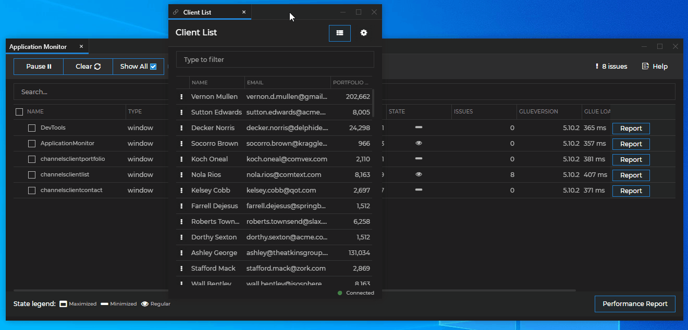

### Columns

Columns are classified in 3 logical groups:

*   Application information - `Type`, `PID`, `Window ID`, `State`, `Glue Version`;
*   Resource consumption (hidden by default) - `CPU`, `Memory`, `Max CPU`, `Max Memory`;
*   Internal performance information - `Creation Time`, `Load Time` (hidden by default), `Glue Load` and `Issues`;

Right click anywhere in the application information grid to choose which columns to show/hide. Drag and drop columns to reorder them.

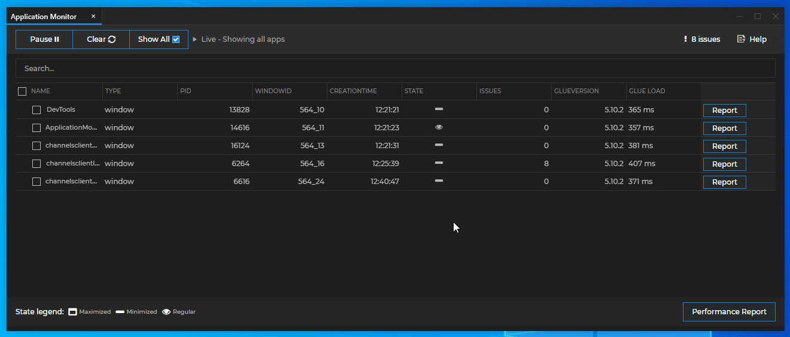

| Column | Description |
|--------|-------------|
| `NAME` | The name is the application name registered in the App Manager. |
| `TYPE` | The type of the monitored application. |
| `PID` | The ID of the window process. |
| `WINDOW ID` | The Glue42 window ID. |
| `CREATION TIME` | The exact time the window was created. |
| `STATE` | The current window state: maximized, minimized or normal. |
| `ISSUES` | The number of issues found. |
| `CPU` | The current CPU usage of the process. (There might be multiple windows in one process and all will show the same CPU usage.) |
| `GLUE VERSION` | The Glue42 framework specific version (JavaScript, .NET, Java) that the app uses. |
| `GLUE LOAD` | The time that [**Glue42 Enterprise**](https://glue42.com/enterprise/) takes to load your app. |
| `MAX CPU` | The maximum CPU usage recorded since the start. |
| `MEMORY` | The memory used by the process. |
| `MAX MEMORY` | The maximum private memory recorded since the creation of the window. |
| `LOAD TIME` | The time between the first and the last recorded events for the application - e.g., from creating the window to the last request made. |

## Performance Report

Performance Report is a tool for finding performance issues of applications running in [**Glue42 Enterprise**](https://glue42.com/enterprise/). It is useful for delving into performance, requests, issues and also enables you to compare app performance. To initiate Performance Report for a single app, click the "Report" button at the end of the row of the respective application. For Performance Report for multiple apps, select the desired apps and click the Performance Report button at the bottom of the window. 

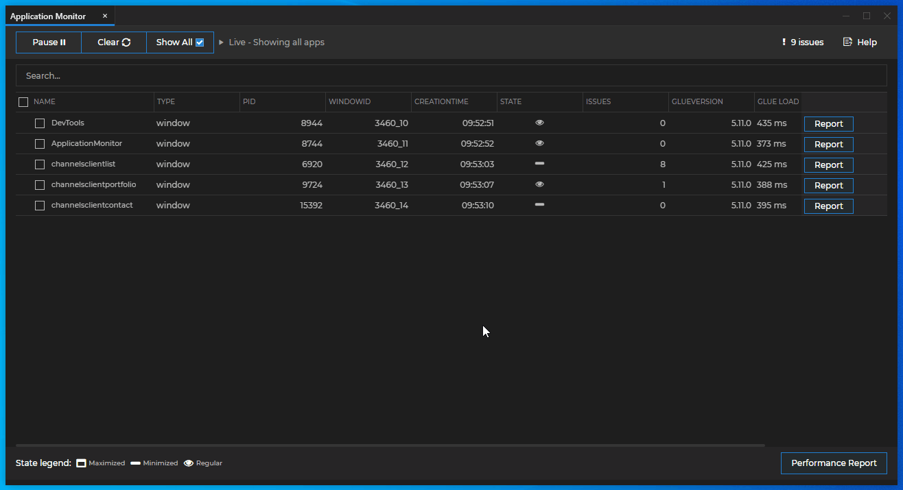

Performance Report visualizes all events happening during the life cycle of an application. The tool shows information about all requests, redirects, console messages, errors and issues. There are 4 groups of built in events.

### Built-in Event Types

#### Browser Events

The browser events are defined using the [Performance Timing](https://www.w3.org/TR/navigation-timing/#sec-navigation-timing-interface) API which offers smart mappings that define when the browser considers a page as loaded, how much time CSS and media take to load, etc.

Some use-cases defined as browser events:

- `TcpConnection` - measures the TCP connection time (the establishing of a connection) using the `connectStart` and `connectEnd` events;
- `DNS` - DNS lookup time using the events `domainLookupStart` and `domainLookupEnd`;
- `DomProcessing` - HTML parsing time using the events `domLoading` and `domInteractive`;
- `subresourceLoadTime` - sub-resources (CSS, images) loading time using the `domInteractive` and `domContentLoaded` events;
- `loaded` - document loading time using the `loadEventStart` and `loadEventEnd` events;
- `request` - measures the HTTP request/response transaction time using the `requestStart` and `responseEnd` events;

#### Glue42 Events

All events grouped as "Glue" events (`connection`, `interop`, `appManager`, `glue`, etc.) measure the time it takes to initialize the respective Glue42 components. These events mark the important initialization stages Glue42 goes through in order for you to be able to use it in your application.

#### System Events

All Electron events - refreshes, interactions, events concerning browser/window creation, etc.

#### Requests 

Network requests and redirects made by the monitored applications.   

### Event Visualization

Events are visualized in 2 different ways - **Data Grid** and **Timeline**. 

#### Data Grid

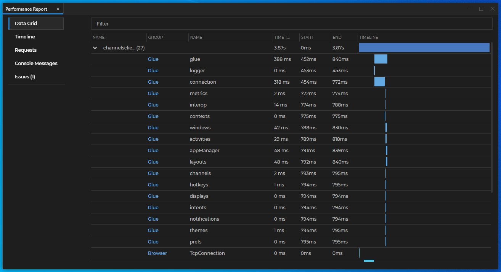

The Data Grid view provides easy filtering, sorting and exporting to Excel (from the right-click context menu). It also has a visual representation in time in the last column.

#### Timeline

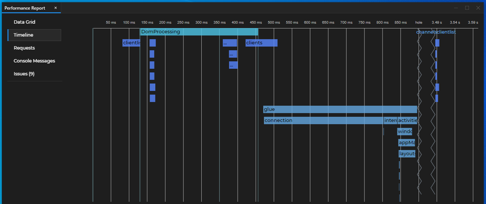

The Timeline view shows the events on a time chart. If you want to find out which apps/events take up the most time, this view will help you. Zoom and drag the timeline chart to see when events take place in comparison to other events. The chart supports comparison of events with a big time difference between them. Unused space on the chart is cut off.

#### Requests View

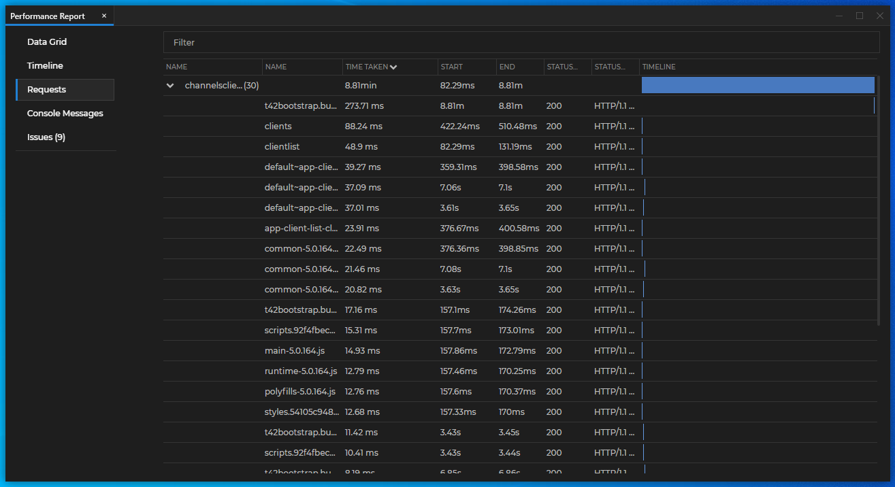

All requests grouped by application with their time, status code, status text and size.

#### Console Messages View


A unified view of all console messages of all monitored applications. Start the Chrome Dev Tools from this tab (convenient for hidden applications).

#### Issues View


An Issue is a pre-defined rule that has been broken:

- Long Requests - requests that take more than 2 seconds;
- Duplicated Requests - a request made more than once in a single run and might be an unnecessary duplicate request.

## Context Viewer

Many applications use some type of Glue42 context to interact with other applications in the Glue42 environment. The Context Viewer provides a convenient way for a developer to edit and track the changes of a context object - a [Glue42 Window context](../../glue42-concepts/windows/window-management/javascript/index.html#context), a [shared context](../../glue42-concepts/data-sharing-between-apps/shared-contexts/overview/index.html) or a [Channel context](../../glue42-concepts/data-sharing-between-apps/channels/overview/index.html).  

Editing and tracking context updates is useful if you want to ensure that your application interacts with context objects as intended. The visual aid and action options provided by the Context Viewer enable you to check whether your app updates the context correctly and whether it reacts to context updates as expected. In some cases, context updates may be happening very frequently rendering the task of retracing the process very difficult. In other cases, an application may be breaking the accepted context data format which in turn causes all other applications interacting with that context object to break. In such situations, the Context Viewer tool greatly simplifies the debugging process.

### Using the Context Viewer

The Context Viewer tracks the following types of contexts in the Glue42 framework:

- Global/Shared Contexts - named objects used for sharing data between applications. [Shared contexts](../../glue42-concepts/data-sharing-between-apps/shared-contexts/overview/index.html) are also used by the Glue42 color [Channels](../../glue42-concepts/data-sharing-between-apps/channels/overview/index.html) as dedicated Channel context.
- Window Context - dedicated [Glue42 Window context](../../glue42-concepts/windows/window-management/javascript/index.html#context);


Choose a context type and click on a specific context to go to the Main Editor page. 

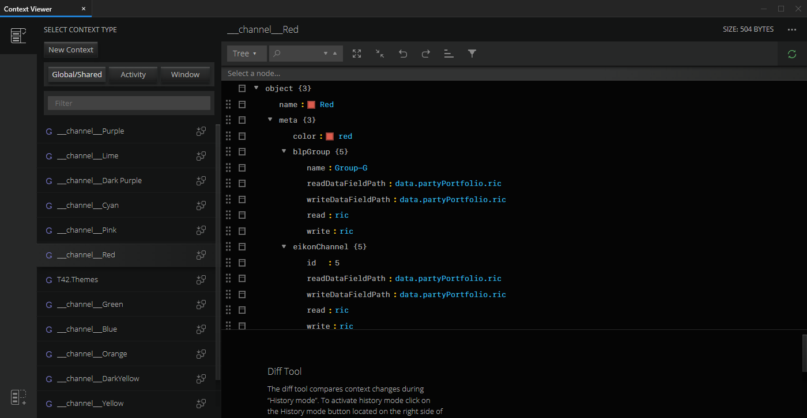

Select context types and specific contexts from the Sidebar on the left. Filter contexts by name, hide and show the Sidebar, start "History Mode" for a one or more contexts:

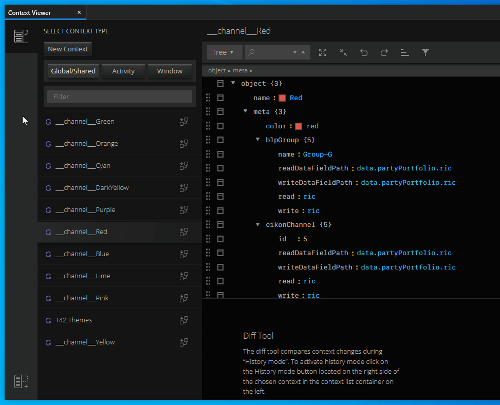

Manipulate a context directly in the Editor. Choose how to view the JSON data, search for properties in the context and more:

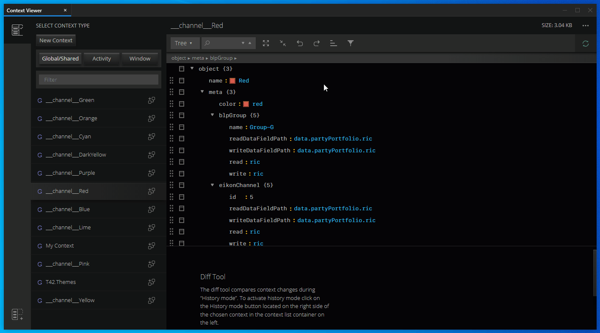

The following buttons may appear in the Editor toolbar (explained below in the same order from left to right):


- "Context Closed" - appears when the context in the Editor is removed. This may happen when a window is closed, a shared context is destroyed or a Channel has been removed. You won't be able to make any manipulations to the context;
- "Save" - Saves the current context.
- "Update" - indicates that the context displayed in the editor isn't the latest one. This button will appear only if the "Auto Update" button is turned off. Click on it to update the context;
- "Auto Update" - when turned on, the Context Viewer will always display the latest context in the editor. If the context changes, the content in the editor will be automatically updated.

### Context Manipulation

Edit the selected context in the Main Editor of the Context Viewer by directly overwriting context values or property names. Save the context from the "Save" button of the editor to see the changes.

In the example below the "Client List" application is listening for context updates on the "Red" Glue42 Channel. The context of the "Red" Channel is opened in the Main Editor of the Context Viewer. See how when the ID of a client is updated, the "Client List" application responds automatically by selecting the respective client:

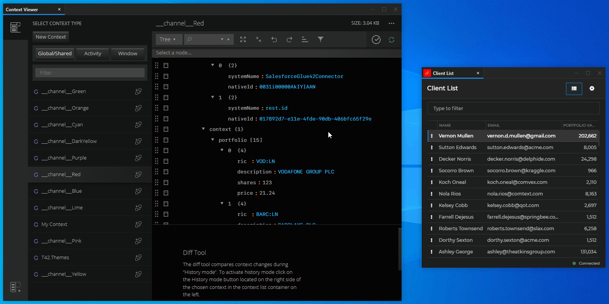

### Tracking Context Change

The Context Viewer allows you to track how contexts change and to compare different context states. 

In the example below, "History Mode" for the "Red" Channel is enabled, meaning that each update of the "Red" Channel context will be recorded as a context state. The Diff Tool displays a list of the context states (to the left) and the difference between two context states selected by the user (to the right):

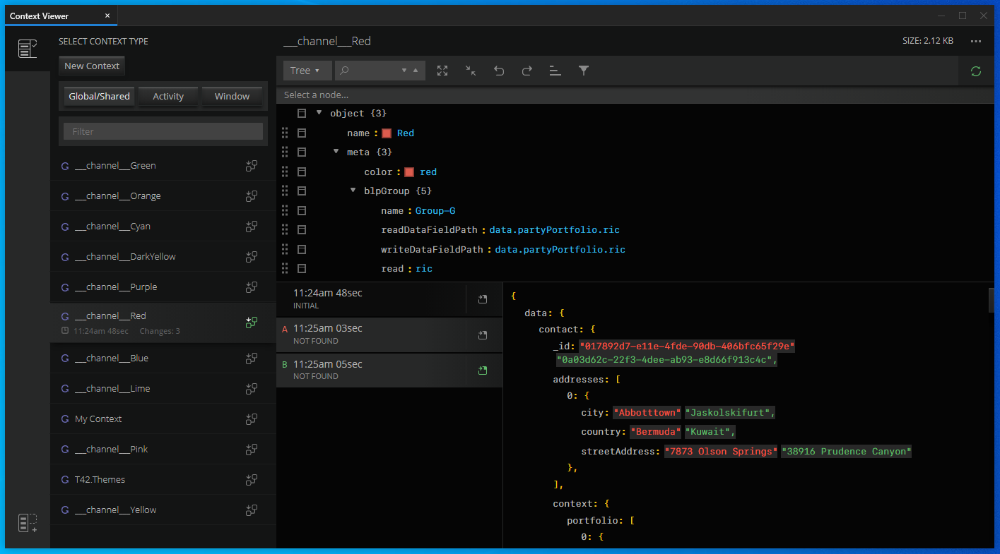

- Click the "Start History Mode" button for the selected context to enable tracking context changes. Track multiple contexts simultaneously by enabling their "History Mode". To see the list of context states for a specific context, select the respective context from the Sidebar.

- The Diff Tool displays a list of the states of the selected context and each state has a timestamp. Select two states ("A" and "B") to see the differences between them in the Diff Tool. The values in red are for state "A" and the values in green are for state "B".

- To show a context state in the Main Editor, click the button to the right of the respective context state.

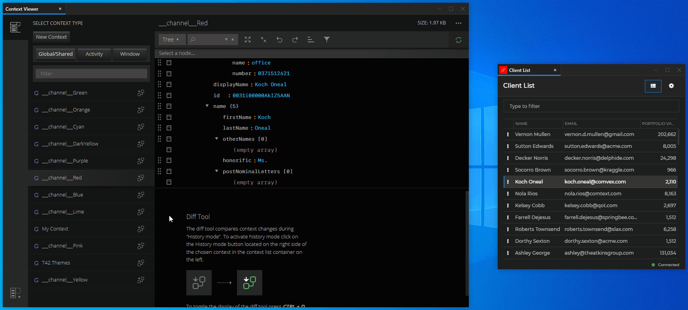

## Interop Viewer

The Interop Viewer allows you to discover all [Interop](../../glue42-concepts/data-sharing-between-apps/interop/overview/index.html) methods and streams registered by [**Glue42 Enterprise**](https://glue42.com/enterprise/) and by your Glue42 enabled apps. Use custom arguments to invoke any Interop method or subscribe to any Interop stream through the Interop Viewer to monitor the results in real time without the help of dummy applications.

The Interop Viewer enables you to test all registered Interop methods and streams to check whether they behave correctly or whether they have been registered in the correct format. The Interop Viewer is useful when debugging your apps, as well as when working on a multi-team project - inspecting the method names and signatures will quickly let you know whether the generally accepted rules for method naming or method signatures are being followed.

The Interop Viewer has the following functionalities:

- [Discovering](#interop_viewer-discovering_methods) Interop methods and streams.

- [Invoking](#interop_viewer-invoking_methods) Interop methods.

- [Subscribing](#interop_viewer-subscribing_to_streams) to Interop streams.

### Discovering Methods

The main view of the Interop Viewer is the browsing section which shows a table with all registered Interop methods and streams. Click on any column header to sort the table by ascending or descending order. Drag and drop columns in the area above the table to group the table entries dynamically by single or multiple columns - e.g., drag the "Streaming" column and then the "Server" column to group the methods/streams first by streaming support and then by the servers offering them. Filter the table entries using the search field. To reset the table view, use the "Reset" button next to the search field.


Browsing section columns:

- "SERVER" - the name (and window ID, if it exists) of the app that has registered the method;
- "METHOD NAME" - the name of the Interop method/stream;
- "ACCEPTS" - method parameter(s) signature;
- "RETURNS" - method return value signature;
- "OBJECT TYPES" - a list of the composite data structures with which the method operates;
- "STREAMING" - shows whether the method is registered as a stream;

To [invoke](../../glue42-concepts/data-sharing-between-apps/interop/javascript/index.html#method_invocation) an Interop method or [subscribe](../../glue42-concepts/data-sharing-between-apps/interop/javascript/index.html#consuming_stream_data-subscribing_to_a_stream) to an Interop stream, click on its row and a new Invocation/Subscription tab will open containing details about the method/stream.

### Invoking Methods

Select a method from the browsing section and click on its row to open it in a new tab:

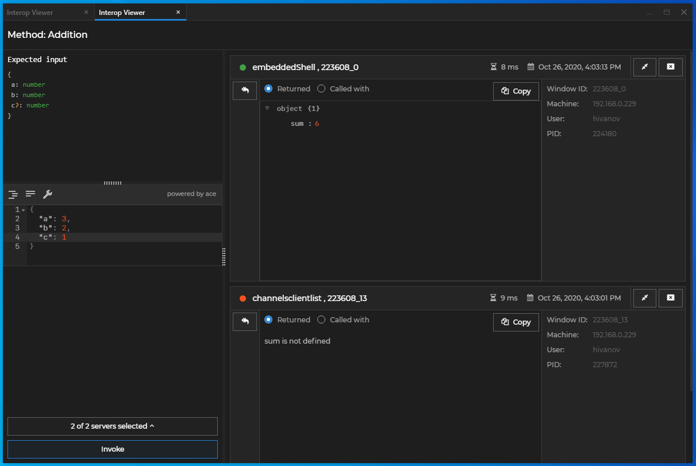

The method tab has three sections - Expected Input, User Input and Invocation Results:

- Expected Input (top-left) - shows the signature of the argument(s) with which the Interop method expects to be invoked. All arguments must be wrapped in an object.

- User Input (bottom-left) - allows you to specify arguments in JSON format with which to invoke the Interop method. The JSON object in the User Input will be prefilled with all required arguments and default values for them (zeros, empty strings, arrays or objects). Use the buttons in the User Input toolbar to format the JSON object, to make it compact (remove all whitespaces) or fix mistakes in it. An expandable menu at the bottom of the User Input section shows all Interop server offering this method - select one or more servers for which to invoke the method. Click the "Invoke" button to execute the invocation.

- Invocation Results (right) - shows a list of results from all method invocations, successful (marked with a green circle) and unsuccessful (marked with a red circle). The header of each result panel shows the status of the method invocation, the name of the server on which the method was invoked, the invocation time (how long it took for the method to return a result) and an invocation timestamp. Switch between "Returned" and "Called with" to see the result from the invocation or the invocation arguments. Use the "Copy" button to copy the result as an object literal (if the invocation is unsuccessful, the object will be empty) to the clipboard. Click the "Use Call Arguments" button on the left of any result panel to use the same arguments for your next invocation.


### Subscribing to Streams

Select a stream from the browsing section and click on its row to open it in a new tab:


The stream tab has three sections - Expected Input, User Input and Subscriptions:

*The Expected Input (top-left) and User Input (bottom-left) sections are identical with the ones for invoking an Interop method and are described in the [Invoking Methods](#interop_viewer-invoking_methods) section above.*

- Subscriptions (right) - shows all subscriptions as timestamped tabs. The status of the subscription is shown as a colored circle in the tab - a blue circle signifies an active subscription, an empty circle signifies a suspended one, or one with error. Switch between "Stream" and "Called with" to see the data received from the stream or the arguments with which the subscription was made. Each subscription tab contains data entries received from the stream subscription. The subscription may be to one or more servers offering the same stream - the data entries from the different servers are color coded. Select a server from the "SERVERS" panel at the bottom of the Subscriptions section to show/hide the data entries from the respective servers. Click on the header of a data entry to expand or collapse it. Use the buttons in the left vertical panel of the Subscriptions section to control the subscription status and results. The "Use Call Arguments" button will insert the arguments from the currently selected subscription in the User Input section. The "Disconnect/Reconnect" button will stop/resume the subscription. The "Expand/Collapse Results" button will expand or collapse all data entries. The "Clear Results" button will remove all data entries. Expand a data entry to see the data chunk received from the stream. Use the "Copy" button to copy the data chunk as an object literal to the clipboard. 