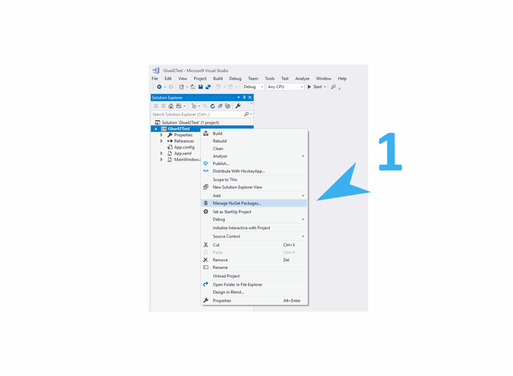

## Referencing

To use any [**Glue42 Enterprise**](https://glue42.com/enterprise/) functionality, you need to reference the Glue42 .NET library (either as a standalone `Glue42.dll` file or as a [NuGet package](https://www.nuget.org/packages/Glue42/)), instantiate and initialize a class called `Glue42`, which provides access to the different [**Glue42 Enterprise**](https://glue42.com/enterprise/) functionalities.

### As a NuGet Package

The [Glue42 .NET](https://www.nuget.org/packages/Glue42/) library is available as a NuGet package which you can include and configure in your projects.



### As a Standalone File

Another option is to reference the `Glue42.dll` - the file is delivered with the [**Glue42 Enterprise**](https://glue42.com/enterprise/) installer and is located in `%LOCALAPPDATA%\Tick42\GlueSDK\Glue42NET\lib\net45\Glue42.dll` (you can alternatively use the NUPKG package located in `%LOCALAPPDATA%\Tick42\GlueSDK\Glue42NET`);

```xml
<Reference Include="Glue42">
    <HintPath>..\lib\Glue42.dll</HintPath>
</Reference>
```

## Initialization

The .NET Glue42 library is initialized asynchronously with an optional `InitializeOptions` object, in which you can specify what Glue42 features you want your application to use.

Here is an example initialization:

```csharp
var initializeOptions = new InitializeOptions()
    {
        ApplicationName = "cl-wpf1",
        IncludedFeatures = GDFeatures.UseAppManager | GDFeatures.UseGlueWindows
    };

// The initialization options aren't required.
// If skipped, Glue42 will be initialized with the default options
// (default assembly name for ApplicationName and with all features included).

Glue42 glue;
Glue42.InitializeGlue(initializeOptions)
                .ContinueWith(glueInit =>
                    {
                        glue = glueInit.Result;
                        // Use Glue42 here.
                    });

```

## Application Configuration

To add your .NET app to the [Glue42 Toolbar](../../../../glue42-concepts/glue42-toolbar/index.html), you must create a JSON file with application configuration. Place this file in the `%LocalAppData%\Tick42\UserData\<ENV-REG>\apps` folder, where `<ENV-REG>` must be replaced with the environment and region of your [**Glue42 Enterprise**](https://glue42.com/enterprise/) copy (e.g., `T42-DEMO`).

*Note that you can also launch manually your Glue42 enabled .NET app and it will automatically register itself and its child windows in the [**Glue42 Enterprise**](https://glue42.com/enterprise/) in-memory store. In this case, your app will be available in the Glue42 environment until the next restart of [**Glue42 Enterprise**](https://glue42.com/enterprise/). This is useful if you have a multi window Glue42 enabled application with dynamic Glue42 enabled child windows (e.g., different user configurations, software updates, etc.) - when your main window starts its child windows, they will be registered automatically.*

The following is an example configuration for a .NET app:

```json
{
    "title": "Client List WPF v1",
    "type": "exe",
    "name": "cl-wpf1",
    "icon": "https://enterprise-demos.tick42.com/resources/icons/w1.jpg",
    "details": {
        "path": "%GDDIR%/../Demos/ClientProfileDemo/",
        "command": "ClientProfileDemo.exe",
        "parameters": " --mode=1"
    }
}
```

| Property | Description |
|----------|-------------|
| `"type"` | Must be `"exe"`. |
| `"path"` | The path to the application - relative or absolute. You can also use the `%GDDIR%` environment variable, which points to the [**Glue42 Enterprise**](https://glue42.com/enterprise/) installation folder. |
| `"command"` | The actual command to execute (the EXE file name). |
| `"parameters"` | Specifies command line arguments. |

*Note that the definition should be a valid JSON file (you should either use a forward slash or escape the backslash).*

For more detailed information about the application definitions, see the [Configuration](../../../../developers/configuration/application/index.html#application_configuration-exe) documentation.

*See the [.NET examples](https://github.com/Glue42/net-examples) on GitHub which demonstrate various [**Glue42 Enterprise**](https://glue42.com/enterprise/) features.*

## Glue42 ClickOnce

[**Glue42 Enterprise**](https://glue42.com/enterprise/) offers support for ClickOnce applications. Below you can see how to initialize the Glue42 .NET library in your ClickOnce application and how to register a ClickOnce application in [**Glue42 Enterprise**](https://glue42.com/enterprise/).

### Initialization

In a ClickOnce application, the .NET Glue42 library is initialized the same way as in other .NET applications:

```csharp
var initializeOptions = new InitializeOptions()
    {
        ApplicationName = "ClientProfileDemo",
        IncludedFeatures = GDFeatures.UseAppManager | GDFeatures.UseGlueWindows
    };

// The initialization options aren't required.
// If skipped, Glue42 will be initialized with the default options
// (default assembly name for ApplicationName and with all features included).

Glue42 glue;
Glue42.InitializeGlue(initializeOptions)
                .ContinueWith(glueInit =>
                    {
                        glue = glueInit.Result;
                        // Use Glue42 here.
                    });

```

You can also set methods for saving and restoring the state of your Glue42 enabled ClickOnce application:

```csharp
initializeOptions.SetSaveRestoreStateEndpoint(GetState, RestoreState);
```

`GetState` and `RestoreState` are user defined methods for what information about the ClickOnce application state to save and later restore.

### Registering a ClickOnce Application

To show your ClickOnce application in the Application Manager of [**Glue42 Enterprise**](https://glue42.com/enterprise/), you need to create a configuration JSON file and add it to the application configuration store.

Here is an example configuration for a ClickOnce application:

```json
{
    "title": "Client List - ClickOnce",
    "type": "clickonce",
    "name": "cl-clickonce",
    "hidden": false,
    "details": {
        "url": "http://localhost:9091/ClickOnceClientProfileDemo.application",
        "width": 1000,
        "height": 400
    },
    "customProperties": {
        "selectedClient": "john",
        "darkThemeOn": true
    }
}
```

| Property | Description |
|----------|-------------|
| `"type"` | Must be `"clickonce"`. |
| `"url"` | The web address pointing to the physical location where the ClickOnce application is deployed and from where it will be installed on the user machine. |
| `"customProperties"` | Application [context](../../../../glue42-concepts/data-sharing-between-apps/shared-contexts/net/index.html) with custom parameters your application can access at runtime through `glue.GDStartingContext.ApplicationConfig.CustomProperties["propertyName"]`. |

## Glue42 Silverlight

We offer a **Glue42 Silverlight** library as a version of the Glue42 .NET library. Glue42 Silverlight offers the same features and functionalities as the Glue42 .NET library, it is only tailored to meet the specifications of the MS Silverlight framework.

## Glue42 .NET Concepts

Once the Glue42 .NET library has been initialized, your application has access to all Glue42 functionalities. For more detailed information on the different Glue42 concepts and APIs, see:

- [Application Management](../../../../glue42-concepts/application-management/net/index.html)
- [Intents](../../../../glue42-concepts/intents/net/index.html)
- [Shared Contexts](../../../../glue42-concepts/data-sharing-between-apps/shared-contexts/net/index.html)
- [Channels](../../../../glue42-concepts/data-sharing-between-apps/channels/net/index.html)
- [Interop](../../../../glue42-concepts/data-sharing-between-apps/interop/net/index.html)
- [Pub/Sub](../../../../glue42-concepts/data-sharing-between-apps/pub-sub/net/index.html)
- [Window Management](../../../../glue42-concepts/windows/window-management/net/index.html)
- [Layouts](../../../../glue42-concepts/windows/layouts/net/index.html)
- [Notifications](../../../../glue42-concepts/notifications/net/index.html)
- [Metrics](../../../../glue42-concepts/metrics/net/index.html)