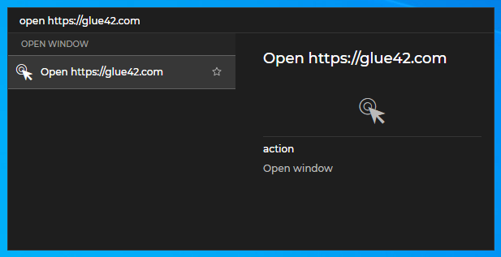
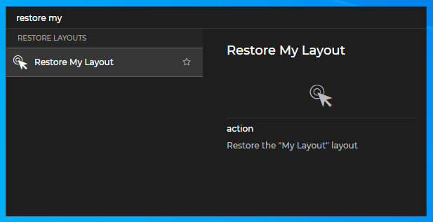
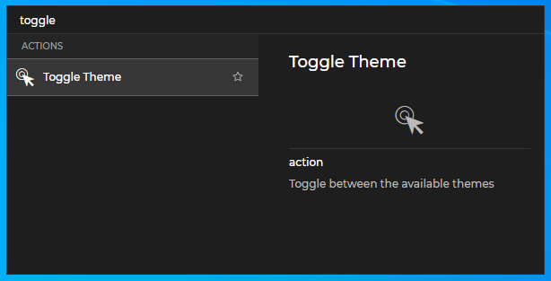
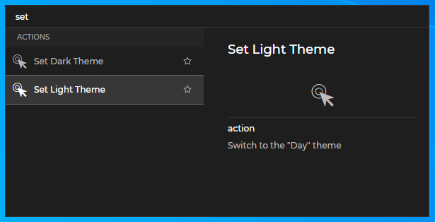
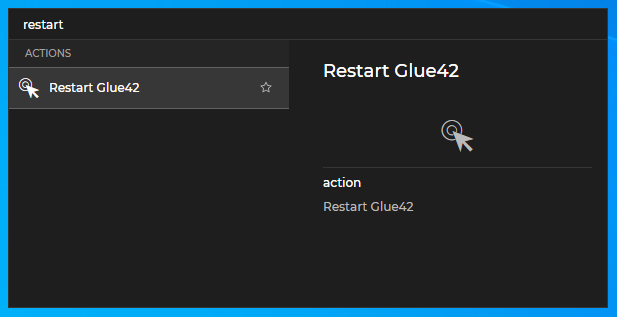

## Overview

<glue42 name="addClass" class="colorSection" element="p" text="Available since Glue42 Enterprise 3.12">

The Glue42 Global Search is a search bar web application that can be opened by the user with a configurable keyboard shortcut and provides an easy way to find and start applications, Layouts, Workspaces and perform [actions](#actions) (switching the theme, saving and restoring Layouts, etc.) by simply typing in the search field and choosing from the relevant results.


## Configuration

The Global Search is a Glue42 enabled web application which you can configure just like any other Glue42 enabled application from its configuration file, named `global-search.json` and located in `%LocalAppData%\Tick42\GlueDesktop\config\apps`.

The default shortcut for the Global Search is `SUPER + /` (Windows key + forward slash), but you can change it from the `"shortcut"` top-level key of the configuration file:

```json
{
    ...
    "shortcut": "ctrl+alt+space",
    ...
}
```

## Usage

The Global Search, much like the Glue42 [Launchpad](../glue42-toolbar/index.html#launchpad), is a tool that benefits greatly power users who prefer working with keyboard shortcuts. It provides a quick and efficient way of searching for items through all [search providers](#creating_search_providers) defined in the Glue42 environment, saving the user time and effort.


Open the Global Search app by pressing its shortcut (the default is `SUPER + /` - Windows key + forward slash). Type in the search bar to find applications, Layouts, Workspaces or [actions](#actions). When results are found, they are listed in a dropdown menu under the search bar - the left section contains the results organized by category (applications, Layouts, Workspaces, actions) and the right section contains a description of the selected item. The first result is selected by default. Use `TAB` to move between the search bar and the "Results" section. Use the up and down arrow keys to navigate through the results. Press `ENTER` to select a result - this will start the app, load the Layout or execute the action and in most cases will hide the Global Search. You can also press `ESC`, press again the Global Search shortcut or click anywhere else to hide the Global Search.

## Actions

[**Glue42 Enterprise**](https://glue42.com/enterprise/) provides the following default actions, available through the Global Search app:

- Open a URL in a Glue42 Window:

```cmd
open [URL]
```



- Save a Layout:

```cmd
save [Layout Name]
```


- Restore a Layout:

```cmd
restore [Layout Name]
```



- Switch between the available themes:

```cmd
toggle theme
```



- Set a theme:

```cmd
set [Theme Name]
```



- Restart [**Glue42 Enterprise**](https://glue42.com/enterprise/):

```cmd
restart
```



- Shutdown [**Glue42 Enterprise**](https://glue42.com/enterprise/):

```cmd
shutdown
```


## Creating Search Providers

<glue42 name="diagram" image="../../images/search/gs-architecture.png">

[**Glue42 Enterprise**](https://glue42.com/enterprise/) is by default a search provider for applications, Layouts and actions. You can create your own search providers for the entities you want to use - e.g., Clients, Instruments, etc. The search provider is usually a [hidden service app](../glue42-platform-features/index.html#service_windows) that starts automatically and may be connected to a REST service. On start up, each search provider must [register an Interop method](../data-sharing-between-apps/interop/javascript/index.html#method_registration) named "T42.Search.Provider" which will be invoked by the Global Search app when the user performs searches. Use this method to implement your search logic, return the results for the desired entities and specify what should happen when the user clicks on a result item. Once you have implemented a search provider, you must host it and add an [application configuration](../../developers/configuration/application/index.html#application_configuration-service_window) for it to your application store.

*See a basic [Search Provider](https://github.com/Glue42/search-provider) example on GitHub and use it as a template for creating your own search providers.*

## Custom Global Search

It is possible to customize the Global Search app that comes with [**Glue42 Enterprise**](https://glue42.com/enterprise/) or use it as a template to create your own search application. You can use the [Global Search template](https://github.com/Glue42/templates/tree/master/global-search) on GitHub as a starting point. The Global Search functionalities are provided as a single React component - `<GlobalSearch />`. Once you have modified the template or implemented an entirely new Global Search app, you must host it, create an [application configuration](../../developers/configuration/application/index.html#application_configuration) file for it and add it to your application store.