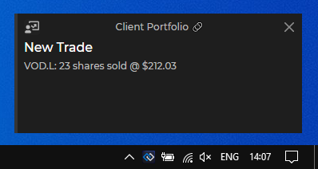

## Raising a Notification

The **Glue42 Notification Service** API can be accessed through the `Notifications` property of the `Glue` object:

```csharp
var notification = new DesktopNotification("New Trade",
	NotificationSeverity.Low,
    "type",
    Description.Text,
    "category",
    "source"
);

App.Glue.Notifications.Publish(notification);
```



*See the .NET [Notifications example](https://github.com/Glue42/net-examples/tree/master/notifications) on GitHub.*

## Notification Click

When raising a notification, you can specify what happens when the user clicks on the notification. By default, this will show the built-in notification details view, but you can replace that with invoking an [Interop](../../data-sharing-between-apps/interop/net/index.html#method_invocation) method. To do this, add a `GlueRoutingDetailMethodName` parameter to your `Notification` object. In the following example, clicking on the notification will invoke the `DetailsHandler` Interop method:

```csharp
var notification = new DesktopNotification(Title.Text,
	NotificationSeverity.Low,
	"type",
	Description.Text,
	"category",
	"source",
	"DetailsHandler"
);
```

## Actions

Notifications may contain actions (usually displayed as buttons in the UI) that the user can execute when they see the notification. Executing an action results in invoking an Interop method. This Interop method can be registered by the publisher of the notification or any other application that can handle the action. The handler of the Interop action can also receive parameters, specified by the publisher of the notification.

In the following example, we add actions **Call Client** and **Open Portfolio** passing a `customerId` parameter to the action handlers:

```csharp
var parameters = new List<GlueMethodParameter>()
{
	new GlueMethodParameter("customerId", new GnsValue("11"))
};

var actions = new List<GlueRoutingMethod>()
{
	new GlueRoutingMethod("CallClient", Description: "Call Client", Parameters: parameters),
    new GlueRoutingMethod("Open Portfolio", Description: "Open Portfolio", Parameters: parameters)
};

var notification = new DesktopNotification(Title.Text,
	NotificationSeverity.Low,
	"type",
    Description.Text,
    "category",
    "source",
    "DetailsHandler",
    actions
);
```


*See the .NET [Notifications example](https://github.com/Glue42/net-examples/tree/master/notifications) on GitHub.*