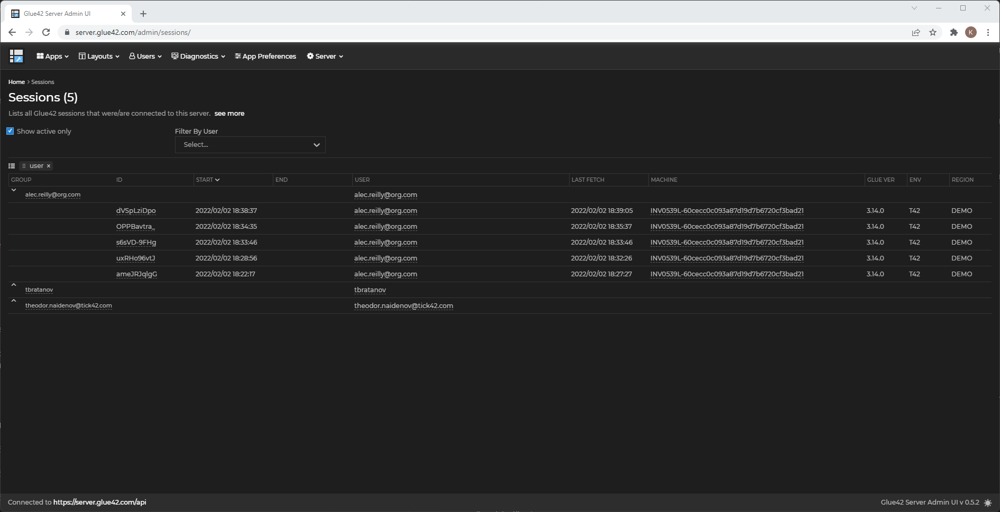

## Overview

<glue42 name="addClass" class="colorSection" element="p" text="Available since Glue42 Enterprise 3.12">

Glue42 Server is a server-side application that provides data to Glue42 (applications, Layouts, preferences) and allows monitoring and interacting with users running Glue42. 

It also includes an Admin UI that helps managing the data stored in the Glue42 Server easier.

<glue42 name="diagram" image="../../images/server/server-architecture.png">

## Features

#### Application Store

The Glue42 Server provides an application definition store that can be used by [**Glue42 Enterprise**](https://glue42.com/enterprise/) to retrieve the list of applications for the current user.

#### Layout Store

The Glue42 Server is a Layout store from where common or private user Layouts can be fetched.

#### Application Preferences Store

The Glue42 Server is an application preferences store where any application running in [**Glue42 Enterprise**](https://glue42.com/enterprise/) can store custom data per user and retrieve it later.

#### Diagnostics

The Glue42 Server comes with an Admin UI which offers the following functionalities:

- Command Center - send commands to specific user sessions for getting logs, triggering page refresh, restarting the desktop client or even executing custom code;
- Feedback and Native Crashes - monitor, review and comment user Feedback and Native Crashes reports;
- User Monitoring - monitor users and their sessions (current and closed), inspect their hardware setup;

## Administrative UI

Glue42 Server Administrative UI helps managing the data stored in the Glue42 Server easier.

#### Dashboard

<glue42 name="diagram" image="../../images/server/admin-ui-dashboard.png">

#### Applications

<glue42 name="diagram" image="../../images/server/admin-ui-apps.png">

<glue42 name="diagram" image="../../images/server/admin-ui-apps-by-group.png">

#### Sessions



## Deployment

Glue42 Server is deployed on premise and runs inside client's network to prevent data leaving the organization.

There are two separate components that need to be deployed:
* Glue42 Server - a NodeJS application, the actual server
* Glue42 Server Administrative UI - a React application that allows managing data stored in Glue42 Server

You also need to have a MongoDB database up and running.

We provide Docker images for the stock implementation. If any customization is needed, we provide NPM packages that allow plugging custom components (e.g. custom authenticator) and building custom versions of the components.

## How to

### Configure Glue42 Enterprise to use Server

1. In system.json file add the following section
````json
"server": {
     "enabled": true,
     "url": "http://localhost:4356/api"        
}
````

2. The above configuration will add Glue42 Server as an extra application store. If you want it to be the only app store, make the appStore array empty *"appStores": []*

3. The configuration in 1. will make layouts & preferences to be stored on the server

4. If you want to send client crashes to the server, edit the output section of crashReporter section

````json
 "crashReporter": {
     "enabled": true,
     "folderPath": "%GLUE-USER-DATA%/crashes",
     "companyName": "Tick42",
     "productName": "Glue42 Enterprise",
     "ignoreSystemCrashHandler": false,
     "output": {
         "type": "server",
         "serverUrl": "http://localhost:4356/api/crashes"
     }
 }
````
### Have Custom Authenticator

To use customization you need to have the glue42 server npm modules - @glue42/server and @glue42/server-admin-ui

**Configure the server to use custom authenticator**

Glue42 Sever comes with different auth modules (auth0, okta, sspi) - you can also implement a custom authenticator that will take care for authentication user requests.

```typescript

import { start, Config } from "@glue42/server";

export class Authenticator implements CustomAuthenticator {

    initialize(): void {
        // will be called when initializing the server
    }

    authenticate(req: Request, res: Response, next: (err?: Error, info?: User) => void): void {
        // a typical implementation would the following
        // 1. extract a token from the req object (e.g. from the authorization request header)
        // 2. validate the token
        // 3. extract user info 
        // 3. call next function
    }
}

const startServer = async () => {
    const config: Config = {
        name: "test-server",
        port: 4356,
        store: {
            type: "mongo",
            connection: "mongodb://localhost:27017/server",
        },
        token: {
            secret: "mV|GuHok*+6N<C5~S|I0Wy^;Vg1!B~{KT4<U'@%6ZweX;]aw)|wkK5}QmodFl.s"
        },
        auth_method: "custom",
        auth_custom: new Authenticator(),        
    };
    
    const server = await start(config);
}

startServer();
```

Checkout this GitHub repository for a full example - https://github.com/kirilpopov/server-example

**Configure the Admin UI to use the custom authenticator**

Following is a dummy implementation of a custom authenticator:

```typescript
import { AuthProvider } from "@glue42/server-admin-ui";

export class CustomAuthProvider implements AuthProvider {
  public isLoading = false;
  public isAuthenticated = true;
  public addTokenToRequest = true;
  public addCredentialsToRequest = false;
  public addUsernameToRequest = false;
  public error: any = undefined;

  public async loginIfNeeded(): Promise<void> {
    // do nothing, we have hardcoded isAuthenticated to true, so this is never called
  }
  public async getAccessToken(): Promise<string | undefined> {
    return "test.token";
  }

  public async getUserInfo(): Promise<{ id?: string | undefined; } | undefined> {
    return {
      id: "test"
    };
  }
}

```

And how to plug into the administrative UI

```typescript
// index.tsximport React from 'react';
import ReactDOM from 'react-dom';

import AdminUI from '@glue42/server-admin-ui';
import '@glue42/theme';
import '@glue42/theme/dist/packages/rc-select.css';
import "@glue42/server-admin-ui/dist/src/styles/index.css";
import "@ag-grid-community/core/dist/styles/ag-grid.css";
import { LicenseManager } from "@ag-grid-enterprise/core";

LicenseManager.setLicenseKey("");

ReactDOM.render(
  <React.StrictMode>
     <AdminUI
      serverBase="http://localhost:4356"
      auth={new CustomAuthProvider()}            
      theme="dark" />
  </React.StrictMode>,
  document.getElementById('root')
);

```

Checkout this GitHub repository for a full example - https://github.com/kirilpopov/server-admin-ui-example

**Add a login page to Glue42 Enterprise**

You might want to include a login screen, that will appear on Glue42 Enterprise startup to authenticate the user 

```json
  "ssoAuth": {
        "authController": "sso",
        "options": {
            "url": "<LOGIN_URL_PAGE>",
            "window": {
                "width": 500,
                "height": 730,
                "mode": "flat"
            }
        }
    }
```
Check [Custom Login Screen](https://docs.glue42.com/getting-started/how-to/rebrand-glue42/functionality/index.html#login_screen-authentication) section for more info.


